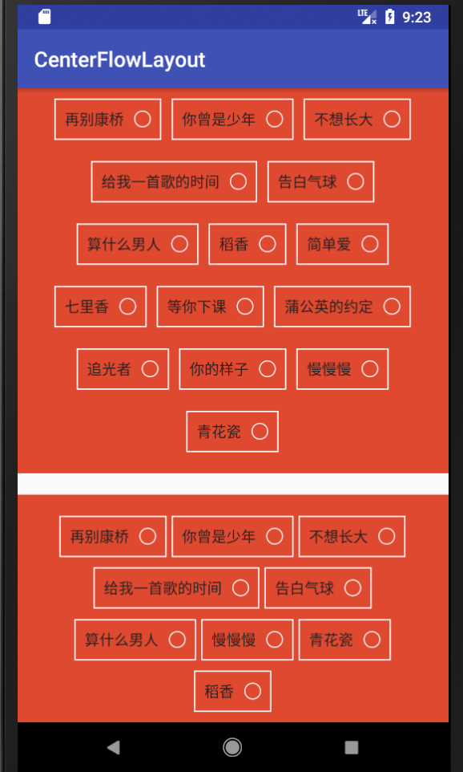

  # CenterFlowLayout
  让你的子View居中显示，并且会在没有足够空间的时候，显示在下一行。
  
 <p align="center">

 </p>

 ## 使用方法
 ```
  <com.zw.centerflowlayout.CenterFlowLayout
            android:id="@+id/id_custom_tag_group1"
            android:layout_width="wrap_content"
            android:layout_height="wrap_content"
            >

            <TextView
                android:layout_width="wrap_content"
                android:layout_width="wrap_content"
                android:layout_height="wrap_content"
                android:text="再别康桥"
                />

            <TextView
                android:layout_width="wrap_content"
                android:layout_width="wrap_content"
                android:layout_height="wrap_content"
                android:text="你曾是少年"
                />
   </com.zw.centerflowlayout.CenterFlowLayout>
 ```
# 属性介绍
| Attribute                | Format                       | Description                                                                                                                                          |
|--------------------------|------------------------------|------------------------------------------------------------------------------------------------------------------------------------------------------|
| childSpacing                   | dimension                      | 子View之间的间距                                                         |
| rowSpacing           | dimension             | 子View的marginTop值   

ps:具体使用方法请查看Demo

